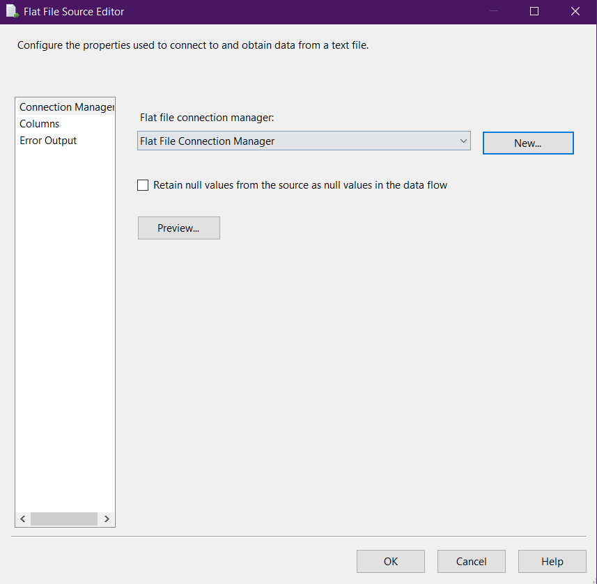

# Data Engineering Project: Egyptian Students Performance Analysis

This project analyzes Egyptian Students Performance data through a comprehensive data engineering pipeline.


## Week 1: Data Management and SQL Database Setup

### Prerequisites

- Microsoft SQL Server
- SQL Server Management Studio
- Python 3.7+
- pip (Python package manager)

### Setup Instructions

1. **Clone the repository:**
   ```bash
   git clone https://github.com/MahmoudMahdy448/egyptian_students.git
   cd egyptian_students
   ```

2. **Install required Python packages:**
   ```bash
   pip install -r requirements.txt
   ```

3. **Configure the database connection:**
   - Copy the `.env.example` file to `.env`
   - Edit `.env` with your SQL Server credentials

4. **Create the database schema:**
   - Open SQL Server Management Studio (SSMS).
   - Connect to your SQL Server instance.
   - Open a new query window.
   - Copy and paste the following SQL script to create the database and table:

   ```sql
   CREATE DATABASE Students

   USE Students

   CREATE TABLE Egyptian_Students(
      Student_Name NCHAR (20) NOT NULL,
      Student_Age INT NULL,
      Student_Year NCHAR (20) NULL,
      Father_Degree NCHAR (20) NULL,
      Mother_Degree NCHAR (20) NULL,
      Education_Type NCHAR (20) NULL,
      Subject_1 FLOAT NULL,
      Subject_2 FLOAT NULL,
      Subject_3 FLOAT NULL,
      Subject_4 FLOAT NULL,
      Subject_5 FLOAT NULL,
      Subject_6 FLOAT NULL,
      Subject_7 FLOAT NULL,
      Subject_8 FLOAT NULL,
      Subject_9 FLOAT NULL,
      Subject_10 FLOAT NULL
   );
   ```

   - Execute the script by clicking the "Execute" button or pressing `F5`.

5. **Prepare the data:**
   - Place the `egypt_education_dataset.csv` file in the `data/` directory.

6. **Ingest data using SSIS:**
   - Open SQL Server Data Tools (SSDT) or Visual Studio with the SSIS extension.
   - Create a new SSIS project.
   - Drag a **Data Flow Task** to the Control Flow tab.
   - Double-click the Data Flow Task to enter the Data Flow tab.
   - Drag a **Flat File Source** to the Data Flow tab and configure it to point to your `data/egypt_education_dataset.csv` file.
   
   - Drag an **OLE DB Destination** to the Data Flow tab and connect it to the Flat File Source.
   
   - Configure the OLE DB Destination to point to the `data/egypt_education_dataset.csv` table in the `Student` Database.
   
   -- 
   -- 
   - Execute the package to ingest the data.
    

### Verifying the Setup

1. Connect to your SQL Server instance
2. Query the `egyptian_students` table to ensure data has been loaded:
   ```sql
   SELECT TOP (1000) [Student_Name]
      ,[Student_Age]
      ,[Student_Year]
      ,[Father_Degree]
      ,[Mother_Degree]
      ,[Education_Type]
      ,[Subject_1]
      ,[Subject_2]
      ,[Subject_3]
      ,[Subject_4]
      ,[Subject_5]
      ,[Subject_6]
      ,[Subject_7]
      ,[Subject_8]
      ,[Subject_9]
      ,[Subject_10]
   FROM [egyptian_students].[dbo].[Egyptian_Students]
   ```
3. Run basic analysis queries (examples in `src/database/analysis_queries.sql`)
---

## Week 2: Data Warehousing and Python Programming

### Prerequisites

- Microsoft SQL Data Warehouse
- Python 3.7+
- pip (Python package manager)

### Setup Instructions

1. **Data Warehouse Implementation:**
   - Implement a SQL Data Warehouse to aggregate and manage large volumes of data for analytical purposes.

2. **Data Integration:**
   - Load data from various sources into the data warehouse.

3. **Python Programming:**
   - Develop Python scripts to interact with the SQL database.
   - Perform data extraction and prepare data for analysis.

### Tools:
- Microsoft SQL Data Warehouse
- Python (Pandas, SQLAlchemy)

### Deliverables:
- A functioning SQL Data Warehouse with integrated data
- Python scripts for data extraction and preparation


