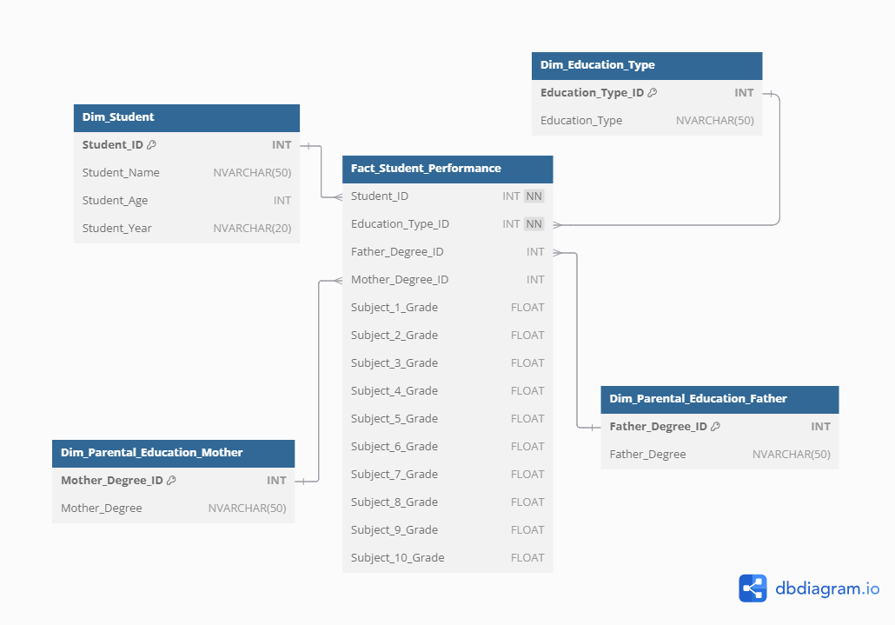
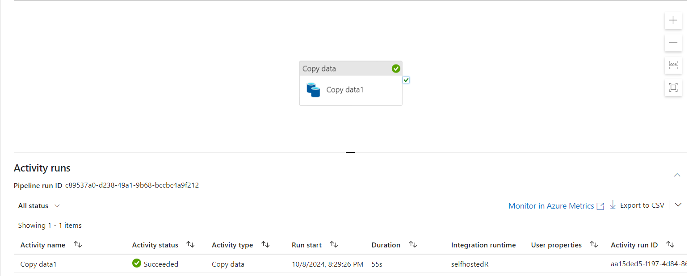
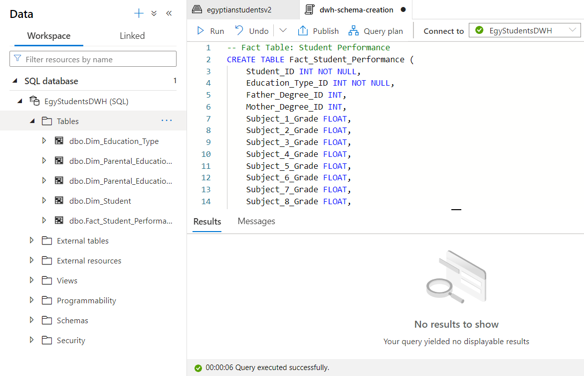

# Data Warehouse Module

 planning and design for the data warehouse and ETL pipeline:
 - [Step 1: Plan for Data Warehouse Phase](#step-1-plan-for-data-warehouse-phase)
 - [Step 2: Requirement Gathering](#step-2-requirement-gathering)
 - [Step 3: Data Warehouse (DWH) Model Design](#step-3-data-warehouse-dwh-model-design)
 - [Step 4: Azure Synapse SQL Pool Data Warehouse Implementation](#step-4-azure-synapse-sql-pool-data-warehouse-implementation)


This module is designed to handle the data warehousing requirements for the Egyptian Students project.
 Before proceeding, here are a few questions to clarify the requirements:

## Data Warehouse Usage

What specific types of reporting or analysis are you planning to support with this data warehouse? Will it primarily be used for tracking student performance, trends across parental education, or something else?

## Source Data

Will the data only come from the single SQL table provided (Egyptian_Students), or do you anticipate incorporating additional data sources (e.g., external education data)?

## Transformation Rules

Are there specific transformations or data cleaning rules we should apply during the ETL process (e.g., handling missing values, standardizing education types)?

## Update Frequency

How often will data be loaded into the data warehouse? Are we expecting incremental updates, or will it be a full load each time?

## Data Warehouse Technology

Using Microsoft SQL Data Warehouse

---


# Step 1: Plan for Data Warehouse Phase
**Objective**:
 Design a data warehouse model that optimizes for efficient querying, reporting, and supports advanced analytics (like classification and regression models). The main data source is the Egyptian_Students table, and the plan should account for data validation, cleaning, and transformation during the ETL process.

## Key Planning Considerations:

**Data Granularity**:

The data should be stored at the most detailed level, with each student’s performance for each subject recorded. This granularity supports fine-tuned analysis, such as determining trends across different subjects, education types, and parental education.

**Schema Design Choice**:
Star Schema: The star schema is optimal for this project because:
It simplifies complex joins for analytical queries.
It enhances query performance, which is crucial for exploratory data analysis and business intelligence reports.
It’s flexible enough to accommodate potential future expansion (e.g., adding new dimensions like teacher performance or additional student-related attributes).

**Dimension Tables**:
Breaking down dimensions like student information, parental education, and education type into separate dimension tables will allow for efficient grouping, filtering, and summarization in queries.
The Dim_Subjects dimension will make it easier to manage and query the various subject-related data, rather than dealing with multiple subject columns in the fact table.

**Fact Table**:
The fact table will centralize student grades by subject, providing the quantitative measures required for reports and predictive models.
Including foreign keys to dimensions such as student, education type, and subjects will facilitate flexible and fast querying.

**Data Transformation**:
Transformations will include ensuring consistent values across attributes like education types and parental degrees. For example, Bachelor, BSc, and Bachelor's should be standardized to a single term.
There will be a need for validation to ensure that grades fall within the specified range (20% - 100%).

**Performance and Scalability**:
The warehouse should be designed to handle future data volumes. While 50,000 records are manageable, the ETL pipeline will be built to ensure that it can handle incremental data loads and grow over time without performance degradation.
Indexing, partitioning, and proper foreign key constraints will be critical to maintain performance for queries.

# Step 2: Requirement gathering

The key to a well-designed data warehouse lies in understanding what kind of insights the stakeholders need from the data. This will guide the granularity, structure, and relationships of the schema. Based on the provided dataset and potential use cases, here’s how we approach gathering requirements:

**Potential Reports and Analyses:**
Here are some common types of reports and analyses that can be generated from the Egyptian_Students data. These will determine the specific metrics, dimensions, and measures we need in the data warehouse.

**1. Student Performance Reports:**
- Overall Performance: Reports on student grades across all subjects to provide a holistic view of their academic performance.
- Subject-Specific Performance: Performance comparison across different subjects for individual students and groups of students. This could help identify trends or issues in specific subjects.
- Trend Analysis: How student performance evolves over time, identifying patterns in improvements or declines.

**2. Education Type Analysis:**

- Performance by Education Type: Comparing the performance of students across different education types (IGCSE, IB, Thanweya). This will help assess which education types lead to higher performance.
- Subject Distribution by Education Type: Analyzing which subjects are more popular or have better grades in specific education types.

**3. Parental Education Impact:**
- Performance by Parental Education: Investigate how parental education levels (father’s and mother’s degrees) influence student performance. For instance, do students whose parents have higher degrees perform better in certain subjects?
- Cross Analysis: Combine education types with parental education to see if any patterns emerge (e.g., whether students in certain education types are more affected by parental education levels).

**4. Classifications and Predictions:**
- Classification Models: Based on the available data, predict the likely education type for a student based on their grades, parental education, and other attributes.
- Regression Models: Predict a student’s performance in certain subjects based on factors such as parental education, type of education, and past grades.

**5. Exploratory Data Analysis (EDA):**
- Demographics: Analyzing the student age distribution and how it correlates with grades.
- School Year Analysis: Compare performance across different school years (Year 9 to Year 12).
- Comparative Analysis: Compare different student groups (e.g., those with parents who hold a PhD vs. those with no formal education).

**Granularity and Schema Impact:**

*Fact Table Granularity:*
 Each record in the fact table will represent a single student’s performance in one subject, which allows for detailed analysis by subject, education type, and parental education.

*Dimension Tables:*
 We will create dimension tables for education type, parental education, and subjects, allowing us to drill down in reports to understand performance at these levels.

By gathering these requirements, we ensure that the data warehouse can support both summary-level reports (e.g., average student performance by education type) and detailed analysis (e.g., individual subject scores and trends over time).


---

# Step 3: Data Warehouse (DWH) Model Design


### **Data Warehouse Model Design** 

The **star schema** design will be structured as follows:



### 1. **Fact Table: `Fact_Student_Performance`**
   - **Granularity**: Each record will represent a student’s performance in one subject.
   - **Measures**: Grades for each subject.
   - **Foreign Keys**: Links to dimensions such as `Dim_Student`, `Dim_Education_Type`, `Dim_Parental_Education`, and `Dim_Subject`.

#### **Fact Table Schema**:
```sql
CREATE TABLE Fact_Student_Performance (
    Performance_ID INT PRIMARY KEY,
    Student_ID INT FOREIGN KEY REFERENCES Dim_Student(Student_ID),
    Subject_ID INT FOREIGN KEY REFERENCES Dim_Subject(Subject_ID),
    Education_Type_ID INT FOREIGN KEY REFERENCES Dim_Education_Type(Education_Type_ID),
    Father_Degree_ID INT FOREIGN KEY REFERENCES Dim_Parental_Education(Father_Degree_ID),
    Mother_Degree_ID INT FOREIGN KEY REFERENCES Dim_Parental_Education(Mother_Degree_ID),
    Grade FLOAT NOT NULL,
    Year INT NOT NULL
);
```

---

### 2. **Dimension Table: `Dim_Student`**
   - **Purpose**: Stores detailed information about each student.
   - **Attributes**: Student name, age, and year level.

#### **Dimension Table Schema**:
```sql
CREATE TABLE Dim_Student (
    Student_ID INT PRIMARY KEY,
    Student_Name NCHAR(50) NOT NULL,
    Student_Age INT NOT NULL,
    Student_Year NCHAR(20) NOT NULL
);
```

---

### 3. **Dimension Table: `Dim_Subject`**
   - **Purpose**: Stores information about the different subjects.
   - **Attributes**: Subject name (e.g., Subject_1, Subject_2, etc.).

#### **Dimension Table Schema**:
```sql
CREATE TABLE Dim_Subject (
    Subject_ID INT PRIMARY KEY,
    Subject_Name NCHAR(20) NOT NULL
);
```

---

### 4. **Dimension Table: `Dim_Education_Type`**
   - **Purpose**: Stores the type of education the student is enrolled in.
   - **Attributes**: Education type name (IGCSE, IB, Thanweya).

#### **Dimension Table Schema**:
```sql
CREATE TABLE Dim_Education_Type (
    Education_Type_ID INT PRIMARY KEY,
    Education_Type NCHAR(20) NOT NULL
);
```

---

### 5. **Dimension Table: `Dim_Parental_Education`**
   - **Purpose**: Stores the highest educational degree obtained by the student's father and mother.
   - **Attributes**: Degree names (e.g., None, High School, Bachelor, Master, PhD).

#### **Dimension Table Schema**:
```sql
CREATE TABLE Dim_Parental_Education (
    Father_Degree_ID INT PRIMARY KEY,
    Father_Degree NCHAR(20) NOT NULL,
    Mother_Degree_ID INT PRIMARY KEY,
    Mother_Degree NCHAR(20) NOT NULL
);
```

---

### Schema Justification and Procedure:

- **Fact Table**: This table captures the performance data for each subject, providing detailed granularity for analysis. The foreign keys link the fact table to relevant dimensions, allowing for multi-dimensional querying.
- **Dimension Tables**: 
  - **`Dim_Student`** stores student-specific data, allowing reports to filter by student attributes like age and year.
  - **`Dim_Subject`** stores subject names (e.g., Subject_1, Subject_2, etc.), which will be referenced in the fact table.
  - **`Dim_Education_Type`** stores the education type (IGCSE, IB, Thanweya), allowing for performance comparison across different types of education.
  - **`Dim_Parental_Education`** stores the father's and mother's education levels, helping with analysis on parental influence on student performance.

This design ensures optimal performance for querying and reporting while making the structure flexible enough for deeper analysis such as comparing student performance across dimensions like education type, parental education, and subjects.

---

# Step 4: Azure Synapse SQL Pool Data Warehouse Implementation

## Step 1: SQL Server to Azure Integration using Data Factory

### 1.1. Set Up Integration Runtime in Azure Data Factory
- Navigate to the **Azure Portal**.
- Create an **Azure Data Factory** instance if you don’t have one.
- In the **Data Factory** interface:
  - Go to **Manage** > **Integration Runtimes**.
  - Click **+ New** and select **Self-hosted**.
  - Follow the instructions to download and install the Integration Runtime on the machine where your SQL Server is running.
  - Configure the integration runtime with your SQL Server credentials.

### 1.2. Create a Pipeline to Copy Data from SQL Server to Azure Data Lake Gen2
- Open the **Author** section in Azure Data Factory.
- Click **+ New** to create a new **Pipeline**.
- Add a **Copy Data** activity to the pipeline.
  - Set the **Source** as your **SQL Server** (using the self-hosted integration runtime).
  - Set the **Sink** as your **Azure Data Lake Gen2** storage account.
- Configure the **Source**:
  - Select the database and table to copy (e.g., `Egyptian_Students` table).
  - Optionally, set filters to select specific data.
- Configure the **Sink**:
  - Choose the destination path in the **Azure Data Lake** where the data should be stored.
  - Set the file format (e.g., Parquet, CSV).
- Validate the pipeline and trigger the **Run** to copy the data.

### 1.3. Monitor the Data Pipeline
- Monitor the pipeline’s execution in **Data Factory** to ensure the data is successfully copied from the SQL Server database to the Azure Data Lake Gen2.
- Once successful, the data will be stored in the specified **Azure Data Lake** container.
    


---

## Step 2: Implement the Data Warehouse Model on the Azure Synapse SQL Pool

### 2.1. Set Up a SQL Pool in Azure Synapse Analytics
- In **Azure Synapse Analytics**, create a new **SQL Pool** (if you haven't already).
- Navigate to the **SQL Pools** section in Synapse and create a dedicated SQL pool for the Data Warehouse.
- Define the **DWU** (Data Warehousing Units) based on your expected workload.

### 2.2. Create the Data Warehouse Model Schema

#### **Star Schema Design**
For the **Egyptian_Students** dataset, a star schema is a suitable data warehouse model to optimize for reporting and querying. We’ll define:
- **Fact Table**: `Fact_Student_Performance`
- **Dimension Tables**: `Dim_Student`, `Dim_Education_Type`, `Dim_Parental_Education`, etc.

Below is the SQL DDL (Data Definition Language) to implement the schema:

```sql
-- Fact Table: Student Performance
CREATE TABLE Fact_Student_Performance (
    Student_ID INT NOT NULL,
    Education_Type_ID INT NOT NULL,
    Father_Degree_ID INT,
    Mother_Degree_ID INT,
    Subject_1_Grade FLOAT,
    Subject_2_Grade FLOAT,
    Subject_3_Grade FLOAT,
    Subject_4_Grade FLOAT,
    Subject_5_Grade FLOAT,
    Subject_6_Grade FLOAT,
    Subject_7_Grade FLOAT,
    Subject_8_Grade FLOAT,
    Subject_9_Grade FLOAT,
    Subject_10_Grade FLOAT,
    CONSTRAINT UQ_Fact_Student_Performance UNIQUE (Student_ID, Education_Type_ID) NOT ENFORCED
);

-- Dimension Table: Students
CREATE TABLE Dim_Student (
    Student_ID INT IDENTITY(1,1),
    Student_Name NVARCHAR(50),
    Student_Age INT,
    Student_Year NVARCHAR(20),
    CONSTRAINT UQ_Dim_Student UNIQUE (Student_ID) NOT ENFORCED
);

-- Dimension Table: Education Type
CREATE TABLE Dim_Education_Type (
    Education_Type_ID INT IDENTITY(1,1),
    Education_Type NVARCHAR(50),
    CONSTRAINT UQ_Dim_Education_Type UNIQUE (Education_Type_ID) NOT ENFORCED
);

-- Dimension Table: Parental Education (Father)
CREATE TABLE Dim_Parental_Education_Father (
    Father_Degree_ID INT IDENTITY(1,1),
    Father_Degree NVARCHAR(50),
    CONSTRAINT UQ_Dim_Parental_Education_Father UNIQUE (Father_Degree_ID) NOT ENFORCED
);

-- Dimension Table: Parental Education (Mother)
CREATE TABLE Dim_Parental_Education_Mother (
    Mother_Degree_ID INT IDENTITY(1,1),
    Mother_Degree NVARCHAR(50),
    CONSTRAINT UQ_Dim_Parental_Education_Mother UNIQUE (Mother_Degree_ID) NOT ENFORCED
);

-- Fact Table Foreign Key Relationships
-- Azure Synapse does not support enforced foreign key constraints,
-- so relationships must be handled through ETL or business logic.
```


---